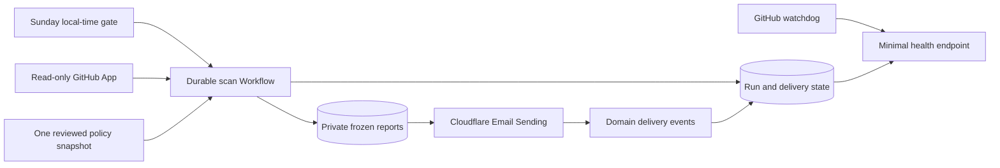

# Architecture

One TypeScript collector, selection resolver and report model serve local previews and the Cloudflare Workflow. The scheduled runtime authenticates as the dedicated read-only GitHub App, reads the reviewed policy once, checkpoints each repository, freezes its report in private R2, and sends the actual Markdown through Cloudflare Email Sending.

## Source ownership

- `src/selection.ts`, `src/policy.ts`: validated scope, private coverage and immutable policy provenance. JSON Schema is compiled ahead of time for Workers; no runtime code generation.
- `src/github/`: installation auth, bounded REST requests, complete pagination, repository collection and bounded artifact readers. Only token minting uses a GitHub POST; repository operations are reads.
- `src/triage/classify.ts`: deterministic evidence rules. Workflow, event and branch scopes are separate. Older cancelled/skipped runs cannot erase a failure, and old removed branches are historical context. PR approvals count only against the current head. Required branch-protection policy remains explicitly unknown.
- `src/report/render.ts`: one report becomes HTML, plain text and complete Codex Markdown, with frozen hashes. External text is escaped and source URLs restricted to GitHub.
- `src/workflow/scan.ts`: per-repository checkpoints and frozen report orchestration. Tokens stay in memory, never in step results. A deadline produces explicit coverage gaps; missing policy/onboarding fails the run.
- `src/email.ts`: outbox claim, fixed recipient, Cloudflare attachment send and delivery-event reconciliation. Provider acceptance and delivery are distinct states.
- `src/storage/database.ts`: additive D1 storage, immutable report bundles and conservative retention.
- `src/index.ts`: authenticated operator endpoints, public minimal health, schedule and queue entry points.
- `scripts/radar.ts`: local policy editing, private preview, onboarding and authenticated operator commands.

The shared `@dustwave/digest-core` 0.1.0 presentation comes from Platform commit `4992520`. Opportunity Radar and this scanner independently pin it. It preserves the existing opportunity HTML byte for byte while consumers retain domain grouping, complete text/Markdown, storage, schedule, addresses and sending. Platform's existing worker-core provides timezone, bounded fetch and authentication comparison helpers.

## Coverage and acceptance

Default selection discovers the configured owner, excludes archives and the configured repository exclusion, and includes accessible private repositories and forks. Setup compares App access with authenticated owner inventory. Missing expected private identities or restricted owner discovery makes coverage incomplete. Selection is not duplicated in Worker vars or a UI database.

Readiness adapters interpret existing JSON artifacts independently of the Actions conclusion. The Podcast adapter preserves platform-ready, launch-ready and PASS/BLOCK/WAIT/DEFER. The configurable scheduled-health adapter preserves consecutive-cycle acceptance independently of a healthy latest run. Artifact provenance comes from GitHub's run/attempt/SHA metadata; artifacts are never executed. Consumer-specific private paths and decisions live only in the private policy bundle.

A complete scan means collection succeeded, not that every project is healthy. Open issues and PRs are review candidates. Green checks, successful builds, deployed code, accepted provider requests, installed apps and physical-device acceptance remain separate evidence.
