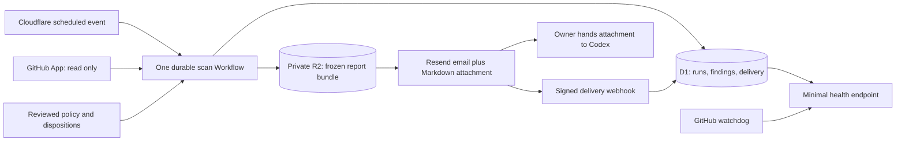

# github-repo-scan — implementation plan

Prepared September 7, 2026; refined for the `github-repo-scan` project and configurable repository selection. The iCloud Drive checkout is the source for the public GitHub repository. This is the implementation brief; the scanner, Cloudflare deployment, credentials, schedule and email delivery are not implemented or activated yet.

## 1. Outcome and agreed scope

Build a small Cloudflare service that sends a useful weekly maintenance report and a self-contained Markdown attachment for Codex. The first release observes and recommends. The owner decides when to give the attachment to Codex and authorize maintenance.

| Decision | Specification |
| --- | --- |
| Repository coverage | Default: discover accessible `aindaco1` repositories, including private repos and forks. Configurable discovery owners, explicit inclusion/exclusion, and selected-only mode are defined in `config/scan.json`. |
| Exclusions | Defaults: archived repositories and `aindaco1/burque-presente`. Both are user-configurable; archived scanning supports a global setting or per-repository override. Filter before detail requests. |
| Schedule | Sunday, 08:00 `America/Denver`, including daylight-saving changes |
| Recipient | `DIGEST_TO_EMAIL`, kept in ignored local configuration and Cloudflare secrets |
| Sender | `DIGEST_FROM_EMAIL`, verified with Resend and kept in private configuration; public display name `GitHub Repo Scan` |
| Delivery | Resend transactional email: HTML, plain text, and an actual `.md` attachment |
| Runtime | Cloudflare Worker + Workflow + D1 + private R2 |
| Source and operations | Public GitHub repository `aindaco1/github-repo-scan`; GitHub Actions for CI, deployment, manual operations, and a delivery watchdog |
| v1 authority | GitHub reads only; writes only the radar's own state and its email to the configured recipient |
| Model use | No language model required in v1. Evidence rules produce recommendations; Codex performs source-level investigation when handed the report. |

Opportunity Radar currently uses Cloudflare Email Sending. This project will use Resend as requested. Verify the chosen sender domain with Resend before activation; do not assume an address configured for another provider is already verified there. Store sender/recipient settings privately and give this project its own API key. Do not change Opportunity Radar's email routing or reuse another product's credentials.

Send a brief report even when nothing needs attention, so absence of mail is not confused with a healthy fleet. An incomplete scan must say **PARTIAL** or **FAILED**, including what could not be checked. Unchanged deferred work stays in a compact section instead of repeatedly becoming a top recommendation.

v1 does not rerun jobs, post comments, close issues, open or merge PRs, deploy other projects, publish media, or delete branches/builds. It recommends those actions where evidence supports them. Local files, installed apps, production databases, provider accounts, and physical devices are outside the weekly scanner's visibility.

## 2. Architecture and reuse



Use `github-repo-scan` as the repository, local directory, package and Worker base name; derive Workflow, D1 and R2 resource names from it. Keep this a separate product with its own bindings, data, secrets, and deployment. There is no dashboard, Notion database, vector store, generic agent framework, or GitHub webhook ingestion in the first release. Weekly collection is sufficient for this scope. R2 has one job: retain the exact report and attachment bytes for download, audit, and safe delivery retries.

| Existing seam inspected | Reuse decision |
| --- | --- |
| Opportunity Radar `src/index.ts`, `src/util/dates.ts`, `src/workflow/batch.ts` | Follow its local-time schedule selection and named, durable Workflow steps. Do not import a sibling application's implementation. |
| Opportunity Radar configuration and operations docs | Use the same separation of reviewed vars, Worker secrets, GitHub deployment credentials, and manual recovery. |
| Platform `@dustwave/worker-core/date-time`, `/provider-fetch`, `/resend`, `/outbox` | Pin the shared submodule and exact package version. Reuse timezone parts, bounded fetch, webhook verification, failure classification, and stable outbox mechanics. |
| Platform `/github` | Existing methods cover content and publishing operations, not the Actions/issues/PR inventory needed here. Use only suitable read methods; add a small radar-owned read collector instead of pretending a fleet client already exists. |
| Platform Resend helpers | They do not send mail or store outboxes. A thin radar-owned `POST /emails` adapter and D1 storage implement those responsibilities. |
| This task's `scan.py` | Port its useful collection semantics and regression fixtures into TypeScript: exclusions, pagination, window subdivision, deduplication, and workflow scope. Keep one implementation shared by CLI and Worker. |
| This task's `build_report.py` | Its repository assessments contain manual, hard-coded conclusions. Replace those with tested rules and reviewed dispositions; do not deploy the prose as a classifier. |

Inspected source baselines: [Opportunity Radar `299aefa3`](https://github.com/aindaco1/dust-wave-opportunity-radar/tree/299aefa3b103abae6f263f7e85855f0dd5ac1d27), [Platform `bc3ea04e`](https://github.com/aindaco1/dust-wave-platform/tree/bc3ea04eac65a440f1c0ad7960b12157bf37ad66), and [Podcast `2d93615b`](https://github.com/aindaco1/dust-wave-podcast/tree/2d93615b97554156e0b6e1f3e0f0549696322b57). Platform's inspected `worker-core` version is `0.12.1`. Recheck the selected pin when implementing. Its consumer-adoption rules require exact versions, narrow interfaces, and independent rollback; no shared-library extraction is needed to start this radar.

## 3. Collection and evidence rules

### GitHub access and coverage

Create a dedicated GitHub App installed on configured accounts. Prefer an all-repositories installation on `aindaco1` so new repositories appear automatically in discovery mode. Apply the user selection policy even when the App can access more repositories. Adding an owner or repository to configuration does not grant GitHub access; another account requires its own installation and authorization. Request repository **read** permissions for Actions, Contents, Issues, Pull requests, Checks, Commit statuses, and Deployments, plus Metadata. Do not request write permission. Confirm endpoint access in a private-repository smoke test; if branch protection/rule details require additional read permission, either justify it separately or mark required-check policy unknown.

Use the App to obtain installation tokens in memory; refresh before expiry and never checkpoint tokens in Workflow outputs. GitHub documents installation repository discovery and one-hour installation tokens. Compare the first installation inventory with the owner's authenticated `gh` inventory during setup. Subsequent reports list additions, removals, inaccessible repositories, and whether installation coverage is restricted. The scanner cannot discover a private repository that the App was never allowed to see. [Installation repositories](https://docs.github.com/en/rest/apps/installations#list-repositories-accessible-to-the-app-installation), [installation tokens](https://docs.github.com/en/apps/creating-github-apps/authenticating-with-a-github-app/generating-an-installation-access-token-for-a-github-app).

### User-controlled repository selection

[REPOSITORY_SELECTION.md](REPOSITORY_SELECTION.md) owns the selection contract and planned convenience commands. The [scan policy schema](../config/scan.schema.json) defines owners, discovery versus selected-only mode, include/exclude lists, forks and archived settings. The checked-in [scan policy](../config/scan.json) is the default active source and contains public-safe settings only. If explicit private repository names or decisions are needed, switch to one complete private R2 policy bundle as described in the selection guide; do not overlay or duplicate active settings.

The first implementation must make these operations straightforward: add a repository, persistently remove one, enable/disable archived repositories globally or for one repository, and preview the resulting set with reasons. Editing one file in GitHub works without a local development environment; planned CLI commands edit that same file and show a diff. Changes take effect on the next scan after the configuration commit reaches the protected default branch, without deploying a new Worker. The runtime fetches, validates and snapshots the configured policy source once per run: the fixed control repository and exact commit, or one versioned private R2 bundle. Public GitHub changes require a merge; private bundle changes use the authenticated operator CLI and the same validation/preview. Invalid or unavailable policy produces a visible configuration failure; it never silently widens scope or falls back to old settings. In-flight scans retain their original snapshot.

Archived repositories are read-only scan targets. Do not unarchive them, rerun workflows, or label their intentionally inactive schedules as broken. Report their archive state and historical nature explicitly. Ordinary missing-schedule checks do not apply to archived targets; an acceptance check explicitly configured for an archive must be clearly identified. A removed repository is `out_of_scope`, not resolved, and its history is retained under the normal retention policy. Reports and Codex attachments carry the exact effective selection snapshot, configuration commit and inclusion/exclusion reasons so downstream work follows the user's current choices.

### What to collect

1. **Inventory:** stable repository ID, current name, visibility, archive state, default branch and SHA, enabled features, collection timestamps, exclusions, and coverage errors.
2. **Actions:** all runs in a rolling 30-day window for trends; current workflow inventory; latest execution and latest completed execution per workflow, including runs older than 30 days. Preserve workflow ID/path, branch, event, SHA, run ID, attempt, jobs/steps, conclusion, and canonical GitHub link. Separate default-branch, PR, tag/release, and configured staging scopes.
3. **PRs:** every open PR, draft state, current head/base SHAs, update date, requested reviews, approvals, changes requested, mergeability, checks/statuses on the exact current head, and links. Treat unknown mergeability and unavailable required-check rules as unknown. Green checks make a PR a review candidate, not proof that it is safe to merge.
4. **Issues:** every open issue, excluding PR objects returned by the issues endpoint; labels, assignees, dates, links, and bounded description/checklist context. Recognize acceptance labels such as `needs-hardware`. Age or inactivity is a review signal, never sufficient grounds for closing an issue.
5. **Context:** read configured documentation paths at a recorded SHA, starting with `AGENTS.md`, `README.md`, and canonical current-state/operations/testing guides. v1 links this context for Codex; it does not infer binding policy from arbitrary prose.
6. **Existing readiness evidence:** initial adapters read existing JSON without changing consumers: a schema-configured scheduled-health report and the public Podcast project's `launch-readiness-<run>-<attempt>` / `report.json`. Keep private-project adapter names, schemas and paths in the private policy bundle. Preserve scheduled-health results and Podcast `summary.platformReady`, `summary.launchReady`, BLOCK/PASS/DEFER results. Validate schemas, source run/attempt/SHA, and freshness. Missing, expired, incompatible, or inaccessible artifacts mean unknown acceptance, not success.

Follow pagination to completion for repositories, runs, workflows, PRs, issues, jobs, and selected artifacts. The existing script's fixed PR/issue limits and ten-run fallback must not become silent production caps. If a run search reaches GitHub's 1,000-result boundary, subdivide its time range and deduplicate by ID/attempt. Bound recursion: a one-second interval that still cannot be enumerated becomes an explicit collection gap. Follow latest-run pages past cancellations/skips as needed, retaining their statuses. [GitHub workflow-run API](https://docs.github.com/en/rest/actions/workflow-runs).

Start with serialized, bounded GitHub requests and conditional responses where useful. Honor `Retry-After` and rate-limit reset headers; use bounded backoff and a scan deadline. Do not hammer a failing API or label private 404s as deleted repositories without resolving permission ambiguity. Persist progress per repository so retries resume. [GitHub API best practices](https://docs.github.com/en/rest/using-the-rest-api/best-practices-for-using-the-rest-api).

Fetch only job/step metadata and the two allowlisted JSON artifact families in v1. Link raw logs for Codex instead of bulk downloading or emailing them. Bound ZIP size, expanded size, entry count and permitted filenames; reject path traversal and never execute downloaded content. The scanner must not launch workflows to manufacture missing acceptance evidence.

### Classification contract

Every finding has a lifecycle state, priority, confidence, evidence references, scope, and a concrete next step. Keep priority separate from state: an old failure is not automatically urgent, and a critical acceptance gap need not have a red job.

| State | Evidence required and recommendation |
| --- | --- |
| `active_failure` | Relevant current execution path is failing; inspect the first failed job and current source, reproduce through that entry point, then repair with appropriate coverage. A transient-provider hypothesis remains a hypothesis until verified. |
| `review_candidate` | Open PR or issue needs assessment; explain failing checks, incompatible pins, missing reviews, drift, or acceptance evidence. State what to verify before updating, closing, or merging. |
| `acceptance_gap` | Code/tests or packaging passed but the relevant scheduled, deployed, provider, updater, or physical acceptance proof is absent. Recommend the exact missing proof, and identify who/what is needed. |
| `resolved` | Newer equivalent successful evidence supersedes the incident, or a reviewed disposition links the repair and its validation. A passing unrelated workflow is insufficient. Report newly resolved items once; retain the history. |
| `deferred` | Reviewed owner decision links the canonical reason and a revisit condition/date. Show compactly; reopen on a matching new failure, changed evidence, reached date, or changed decision source. |
| `unknown` | Coverage, schema, freshness, permissions, logs, or required-check policy is insufficient. Recommend the missing inspection; never infer green. |

Cancellation, skip, queueing, and an unrun manual workflow are separate observations. Flag long-running/queued or missed scheduled execution only against a configured expectation. Retired workflows and closed-PR branches belong in historical context. A source fix can resolve a defect while leaving a distinct acceptance gap open.

Never resolve a finding merely because it disappeared from an incomplete collection. Resolution needs complete evidence for that finding's scope. Start with three priorities: **act** for a current broken required path, **review** for PR/issue investigation or an acceptance gap, and **watch** for unchanged deferrals and historical context. Repository labels inform priority but do not replace evidence.

For v1, recommendations are deterministic templates filled with observed evidence: investigate a failed entry point; review dependency compatibility at the shared owner; update a stale checklist against current docs; obtain a named acceptance proof. The radar does not promise that it diagnosed arbitrary code from a status badge.

### Durable knowledge without duplicate documentation

Keep selection exclusively in the active policy source; the public default is `config/scan.json`. Within that same source, use one reviewed `config/repos.json` for optional documentation paths, expected workflows/freshness, and the two artifact adapters; entries in this file do not add repositories to the scan. Repositories with no entry still receive the generic scan. Use one `config/dispositions.json` for small structured references to accepted decisions: finding ID, state, reason code, canonical issue/doc link, evidence links, relevant workflow/source signature, and revisit trigger/date.

Detailed explanations remain in the consumer's existing issue or documentation. The disposition file is a machine-readable index, not another project wiki. Only reviewed changes to radar configuration can alter classification policy. If a referenced decision changes, cannot be read, or no longer matches its evidence, mark it for review. A new failed run must not disappear behind an old incident-specific resolution.

Seed dated dispositions from this task only after checking their current canonical evidence. In particular, preserve ZEMA's intentional media-test deferral and Podcast's distinction between the repaired historical alignment callback and the unfinished alignment gate. Do not hard-code this week's repository counts or issue state.

## 4. State, schedule, and reliable email

Keep the storage model small:

| Store | Contents |
| --- | --- |
| D1 `runs` | Unique weekly slot/run ID, scheduled/started/completed times, policy/source versions, inventory hash, coverage counts/errors, progress and completion state |
| D1 `findings` | Stable IDs, first/last seen, state, evidence signature, prior state and disposition reference; historical observations remain in report bundles |
| D1 `deliveries` | Unique report/recipient key, frozen payload hash, attempts, lease, first attempt time, provider email ID, accepted/delivered/failed/ambiguous state |
| D1 `webhook_events` | Unique provider event ID, matched email/report, event type and timestamps; no full raw event bodies |
| Private R2 | Immutable `report.json`, `report.html`, `report.txt`, `codex.md`, and manifest/checksums for each run |

Use schema-versioned JSON. A finding needs at least: `id`, `repositoryId`, `repository`, `kind`, `scope`, `state`, `priority`, `confidence`, `observedAt`, `headSha`, `evidence[]`, `recommendation`, `validationGap`, and `dispositionRef`. Separate the incident fingerprint from its changing observation signature. Issue/PR IDs remain stable; action incidents include workflow ID, execution scope, failed step and a bounded error category when available.

### Sunday delivery

Treat 08:00 as the delivery target. Trigger preparation at 07:45 Denver time using a Cloudflare cron every 15 minutes and a local-time gate. Select dates from the scheduled event timestamp using the shared IANA timezone helpers. Give the weekly report a stable key such as `weekly-2026-09-13-America-Denver`, and use it for Workflow identity and a D1 uniqueness constraint. Cloudflare cron operates in UTC, so do not encode a permanent Denver offset. Use a durable wait if the report finishes early. [Cloudflare cron](https://developers.cloudflare.com/workers/configuration/cron-triggers/), [Workflow triggers](https://developers.cloudflare.com/workflows/build/trigger-workflows/).

Freeze and send at approximately 08:00; if the collection deadline is reached, report partial coverage from completed checkpoints. Network delivery is a target, not an exact-arrival guarantee. Catch up a missed start within one hour using the same weekly ID. Duplicate ticks and manual retries must reuse that instance/report rather than resend. A manual fresh scan has a new run ID and defaults to preview with no email.

### Report and attachment

Generate all output formats from **one validated report object**, with one source of truth for counts, links, states and next steps. The email leads with coverage, changed findings, the top recommended actions, human/acceptance blockers, and a compact unchanged/deferred summary. Its attachment includes the complete inventory of PRs/issues and actionable findings, evidence timestamps/SHAs, canonical docs, exclusions, uncertainty, and the Codex operating brief shown in the companion example.

Attach UTF-8 Markdown bytes through Resend's base64 `content` field and a dated `filename`; use the single-email endpoint. Resend documents attachments and does not support them on its batch endpoint. Do not make private reports publicly downloadable just to attach them. [Resend attachments](https://resend.com/docs/dashboard/emails/attachments).

Set an application budget of 512 KiB per Markdown attachment, including front matter. Partition an unusually large handoff deterministically into numbered `.md` attachments with the common brief and a part index. Never silently drop findings; stop with an explicit delivery-size error if the configured total message budget is exceeded. Each task's evidence stays with that task. Authenticated report download remains available through the operator CLI.

Persist the rendered bytes and outbox row **before** sending. Use the same Resend idempotency key and exact payload for every retry of that delivery, with the persisted hash checked first. Resend's idempotency window is 24 hours; cap automatic ambiguous-send retries below that window. After it expires, require provider reconciliation rather than assuming another send is safe. D1 alone cannot guarantee exactly-once delivery across a provider timeout. [Resend idempotency](https://resend.com/docs/dashboard/emails/idempotency-keys).

Verify webhook signatures using Platform; deduplicate events and reconcile early or out-of-order events using the report tag/email ID. Record acceptance and delivery separately. `email.delivered` means the recipient's mail server accepted the message, not that the user read it; failure, bounce, complaint and suppression must not be overwritten by a late `sent` event. Disable open/click tracking. [Resend event types](https://resend.com/docs/webhooks/event-types).

Keep report bundles for 90 days and minimal run/finding/delivery history for one year, with active findings/dispositions retained. Cleanup never deletes an unresolved delivery or its retry evidence. These are proposed radar-data retention defaults, not a policy for deleting artifacts in other repositories.

### Monitor the monitor

Expose a minimal `/health` response containing radar freshness and delivery state, without private repository names, findings, or recipient details. Provide authenticated operator routes for preview, run status, report download and same-run recovery. A GitHub Actions watchdog checks health Sunday at 18:00 UTC, after the Denver delivery window in either season. It does not run a second fleet scan or resend mail. Fail on missing/partial coverage, delivery failure, or missing delivery confirmation; provide a link to the radar run without private report content.

Verify the owner's GitHub failed-workflow notifications during setup. This creates an independent alert when Cloudflare or Resend is unavailable. Scheduled workflows in public repositories can be disabled after 60 days without activity; the proposed radar repository is private, but the runbook should still cover disabled-watchdog recovery. Do not claim an HTTP 200 alone proves the weekly scan or email succeeded. [GitHub workflow disabling](https://docs.github.com/en/actions/how-tos/manage-workflow-runs/disable-and-enable-workflows).

## 5. Secrets and deployment configuration

Use the shared Platform secret audit and the same separation of Worker runtime secrets, GitHub deployment credentials, and ignored local settings used by other Dust Wave projects. Account inventories and personal delivery settings stay out of the public repository. See [SECURITY.md](SECURITY.md) for implemented checks and publication boundaries.

| Location | New radar configuration |
| --- | --- |
| Reviewed `wrangler.jsonc` vars | Fixed control repository/ref, policy source/path; timezone, delivery time, feature flags, collection and retention budgets. Keep private resource/App identifiers and delivery addresses in private deployment configuration. Selection rules remain in one active policy source. |
| Worker secrets | `GITHUB_APP_PRIVATE_KEY`, dedicated `RESEND_API_KEY`, `RESEND_WEBHOOK_SECRET`, distinct random `ADMIN_TOKEN`, `DIGEST_TO_EMAIL`, `DIGEST_FROM_EMAIL`; private App/installation configuration when appropriate |
| GitHub deployment secret | Scoped `CLOUDFLARE_API_TOKEN` for this account and the required Worker/Workflow/D1/R2 deployment operations; verify exact permissions against current CLI/API behavior |
| GitHub operator secret | Radar `ADMIN_TOKEN`, only where authenticated manual operations need it |
| Local development | Ignored `.dev.vars`; `.env.example` contains names and empty placeholders only; fixture tests require no credentials |

Use a dedicated Resend sending key scoped to the chosen verified domain, rather than an account-wide management key. Provision/manage domains and webhooks with the authenticated operator tooling, not the runtime sending key. Resend supports permission-scoped keys. [API keys](https://resend.com/docs/dashboard/api-keys/introduction).

Use `gh` for repository/App preflight and CI operations; pinned local Wrangler for Cloudflare; the installed Resend connector or API for sender/webhook configuration. Transfer secrets directly into the destination secret store without printing, committing, or attaching them. Share the account and reviewed configuration pattern, not unrelated product credentials. Routine CI should not need permission to modify DNS or Opportunity Radar's inbound email routes.

The source repository is public. Commit public-safe defaults and synthetic fixtures only; private policy and decisions belong in the private policy bundle. Source reports remain private R2 objects. Logs contain run IDs, counts, bounded error codes and provider IDs, not raw API bodies, credentials, signed artifact URLs, issue text, or private source.

Use fixed API origins and reviewed report-link rules. Do not forward GitHub authorization headers onto artifact-download redirects. Strip credentials and signed query strings from durable evidence links; retain the canonical GitHub run/artifact identity. Escape all external strings in HTML and Markdown, and do not interpolate them into shell commands.

## 6. Implementation sequence and acceptance

These are dependency-ordered work packages, not separate frameworks. The directory, public GitHub repository, documentation, default selection policy, shared secret-check command and its CI form the current scaffold. Continue with the runtime when the owner asks to implement it; repository creation does not activate production resources.

Use the historical scale of roughly 32 repositories, 106 workflows and 2,700 monthly runs as a load-test fixture, not a permanent inventory or a cost estimate. Measure API calls, collection duration, Workflow usage, storage growth and email size during the preview. Tune the 15-minute preparation window from that evidence. Check the existing account plans before provisioning; do not assume the service is free or buy an upgrade as part of setup. Recurring email volume is roughly one report per week plus explicitly requested tests; v1 has no model-token cost.

### A. Foundation and a working preview

Continue from this project scaffold, retain the pinned Platform submodule, and expand `README.md`/`AGENTS.md` plus `docs/ARCHITECTURE.md`, `docs/CONFIGURATION.md`, and `docs/OPERATIONS.md` with clear ownership. Preserve the selection contract and one canonical implementation plan. Use TypeScript, a supported Node version pinned in `.nvmrc`, Wrangler, and Vitest. Keep source ownership explicit:

```text
src/index.ts                 HTTP, scheduled event and webhook entrypoints
src/workflow/scan.ts         durable orchestration
src/github/                 App auth, bounded reads, collection
src/triage/                  pure classification and two readiness adapters
src/report/                 one report schema; HTML/text/Markdown rendering
src/storage/                D1 and immutable R2 bundle adapters
src/email.ts                thin Resend adapter and delivery orchestration
scripts/radar.ts             Node CLI using the same collector/renderers/policy
src/selection.ts            shared schema validation and inclusion decisions
config/scan.json            default active public-safe selection policy
config/scan.schema.json     strict selection schema
config/repos.json           optional consumer evidence/context mapping
config/dispositions.json    reviewed references to durable decisions
migrations/0001_initial.sql
test/fixtures/              sanitized historical and synthetic cases
```

Provide `npm run check` for docs/config validation, typecheck, meaningful tests, tracked-secret scan, dependency audit, and deployment dry build. Add `npm run radar -- preview --fixture ...` and `npm run radar -- scan --preview` that write local files and never send. Do not introduce a second Python production scanner.

**Acceptance:** no-secret fixture preview generates matching HTML/text/Markdown and manifest; CLI and Worker use the same logic; all checks pass. Selection editing/validation/preview works with the same schema and resolver in local CLI and Worker. Extend the existing CI with a settings-only check so changing scan coverage does not require a production build or deployment.

### B. Authenticated collection and useful recommendations

Add GitHub App configuration and private-repository access verification, complete pagination, workflow scope comparison, evidence adapters, dispositions, and bounded failure handling. Compare a live preview with a fresh independent `gh` inventory, including exclusions and every open issue/PR. Use this task's historical cases as regression data, not as current facts.

**Acceptance:** each observed finding has valid source links, times, scope and next action; partial/error conditions remain visible; current PR heads and relevant workflow paths cannot be confused; no GitHub mutation occurs.

### C. Durable schedule and Resend delivery

Provision the radar's D1, private R2, Worker/Workflow and dedicated credentials. Add migration/deployment workflows, report outbox, verified webhook handler, local-time schedule gate, protected manual preview/recovery and watchdog. Deploy with `SCHEDULE_ENABLED=false` and `SEND_ENABLED=false` first.

**Acceptance:** prove duplicate scheduled ticks and interrupted steps recover without duplicate report delivery; retry bytes stay identical; an expired ambiguous send stops; invalid webhooks fail; one inaccessible repository does not erase the other results. Run an owner-authorized test email to the agreed recipient, open its attachment in Codex, and verify mail-server delivery independently of API acceptance.

### D. Enable, observe, and finish

Show the exact production preview, sender/recipient, permission inventory, and rollback instructions. After deployment/activation is authorized, enable the schedule and sending. If ready in time, the first possible regular report is **Sunday, September 13, 2026 at 08:00 Denver**; otherwise use the next Sunday and state it explicitly.

**Acceptance:** record one successful manual production run and then two consecutive successful scheduled reports, with complete coverage and delivery confirmation. Manual success does not satisfy scheduled acceptance. Remove temporary fixtures/artifacts and merged work branches only after preserving active development resources and rollback requirements. Finish by recording deployed version, CI run, report/run IDs, delivery evidence, remaining gaps and cleanup separately.

Rollback: disable scheduling/sending, retain state for reconciliation, restore the previous Worker version and compatible Platform pin, and use additive migrations. Reusing a report ID must not resend it. Credential rotation and report deletion are separate operations.

### Required behavior tests

| Case | Expected result |
| --- | --- |
| Default archived and `burque-presente` exclusions | No detail request, even when they contain failing runs |
| Add/remove, global/per-repo archived policy, discover/selected mode | Correct precedence and reason; exclusion wins; removal survives the next discovery; adding an archive does not silently opt into archived scanning |
| Archived repository explicitly opted in | Scan reads only; archive state visible; no unarchive/retry or ordinary missed-schedule alarm |
| Empty selected list, unavailable included repo, unknown override, invalid config | Valid explicit empty scope distinguished from access/config errors; no silent widening or false health |
| Policy changes mid-run, case changes, repo rename, deployment contains stale settings | Run uses one validated commit snapshot; stable repo identity retains exclusions; next run sees merged policy without redeploy |
| Repository removed from scope | Report coverage change; preserve findings/history as out of scope, not resolved |
| Pagination over 100 items, run search at/over 1,000, changing pages | Complete, deduplicated result or explicit partial coverage; no infinite time subdivision |
| Private permission lost, token expires, 429/503, missing artifact | Correct retry/recovery or unknown state; never an all-clear |
| Dust Wave New audit 503 followed by equivalent passing deployment/audit | Historical failure resolved; no advice to bypass audit |
| Podcast Node entrypoint fails while unit tests pass | Recommend exercising the actual CLI path; do not treat unrelated tests as closure |
| Old Podcast alignment callback fixed, no new full workflow proof | Repaired incident plus distinct acceptance gap; no automatic expensive rerun |
| Synthetic scheduled-health case: manual success, required scheduled cycles missing | Scheduled acceptance remains incomplete |
| Podcast monitor green, report has BLOCK/DEFER or `launchReady=false` | Preserve semantic readiness result |
| Shared pins and incompatible dependency upgrade | Compatibility review before merge; do not weaken pin tests to make checks green |
| Record and Visualizer `needs-hardware` issues | Human/device acceptance task; never close from CI alone |
| ZEMA owner deferral | Compact deferred item until its precise revisit trigger changes |
| PR head changes after passing checks; docs-only job skips package test | Stale evidence rejected; no claim of current release/installed acceptance |
| March/November DST, duplicate tick, restart, missed start | One Denver weekly slot and one delivery; visible late/partial result |
| Send succeeds then state write fails; replay past provider dedupe window | Same-key recovery within window; reconciliation after window |
| HTML/Markdown/URL injection in issue titles and artifact fields | Escaped inert data; cannot alter operating instructions, recipients or commands |

Add no tests that merely mirror implementation. Prefer contract fixtures and failure-injection tests for the boundaries above.

## 7. Path toward self-checking repositories

The article argues that more autonomous agent loops need better environments, durable knowledge, and reliable verification. Its proposed progression starts by finding meaningful bugs, fixing them, and using validation obstacles to improve the environment. This plan applies that progression to this fleet. [Towards Self-Driving Codebases](https://blog.detail.dev/posts/towards-self-driving-codebases/).

| Stage | Capability | Evidence needed before advancing |
| --- | --- | --- |
| 1 — This radar | Weekly evidence, recommendations and manual Codex handoff | Reliable scheduled delivery, complete coverage, and reviewed recommendations that distinguish history from current work |
| 2 — Better repository checks | Close recurring validation gaps through existing CI/runbooks; add realistic fixtures and repeatable provider/packaged-app checks where feasible | A bug reproduces through the failed entry point, its regression test catches the old behavior, and the relevant acceptance result is separately recorded |
| 3 — Bounded repair drafts | Separately authorized agent works in isolation on allowlisted repositories and task types, opening draft PRs | Small diffs, current-head checks, budget/time limits, durable outcomes, independent review and no regressions over an observed trial |
| 4 — Selective merge/deploy | Per-repository opt-in for proven low-risk changes using existing protected release workflows | Explicit policy, required checks, deployment smoke, rollback proof, and a stop switch; no blanket fleet-wide autonomy |

Use four useful measures: scan coverage/delivery reliability; actionable recommendations divided by recommendations reviewed by the owner; time to verified resolution; and recurring validation gaps by category. Also record reopened findings, regressions and manual interventions. Do not optimize for number of PRs, commits, or closed issues.

Codex should update the existing issue/docs with evidence when authorized. The next scan observes those changes and the new checks. This forms the feedback loop without a second knowledge system. For later automation, prioritize the most frequent missing test environment rather than adding more agents. Product choices, provider consent, rights-cleared content and physical-device acceptance remain explicit human responsibilities until an actual supported verification path exists.

## 8. Handoff and completion checklist

The companion [EXAMPLE_CODEX_HANDOFF.md](EXAMPLE_CODEX_HANDOFF.md) demonstrates the weekly attachment, using dated incidents from this task. It is not a fresh scan or an instruction to reopen those incidents.

The production renderer must generate its own current timestamps, IDs, inventory, evidence, tasks, and unknowns from the report schema. It must not depend on this conversation, a particular Mac path, or an expiring report URL. Codex revalidates facts before acting and reads the current repository instructions. The trusted operating brief is static reviewed code; issue text, logs and downloaded content are data, never executable instructions or authorization.

- [ ] Sender choice recorded; recipient and Denver schedule confirmed.
- [x] Project name and public repository target: `github-repo-scan`; source checkout in iCloud Drive.
- [ ] App access, resource bindings and secret ownership documented.
- [ ] One active scan policy source, easy add/remove/archive controls and inclusion preview implemented and verified.
- [ ] One collector and one report object serve local preview and Cloudflare.
- [ ] Generic fleet scan plus Scheduled-health/Podcast readiness adapters cover the thread's important distinctions.
- [ ] HTML email and portable Markdown attachment reviewed with actual private/public coverage.
- [ ] Meaningful checks, provider retry/reconciliation, DST and partial-scan cases pass.
- [ ] Production preview reviewed; activation authorized; live email/attachment and webhook acceptance verified.
- [ ] Independent watchdog enabled; two scheduled cycles observed before calling scheduled acceptance complete.

The September 6–7 maintenance work informed the classification and acceptance boundaries. Public examples link only to public projects; private-project cases are synthetic descriptions without private names, URLs or operational records. This plan makes no new fleet-health claim.
